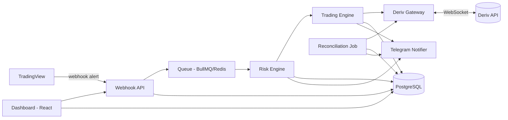
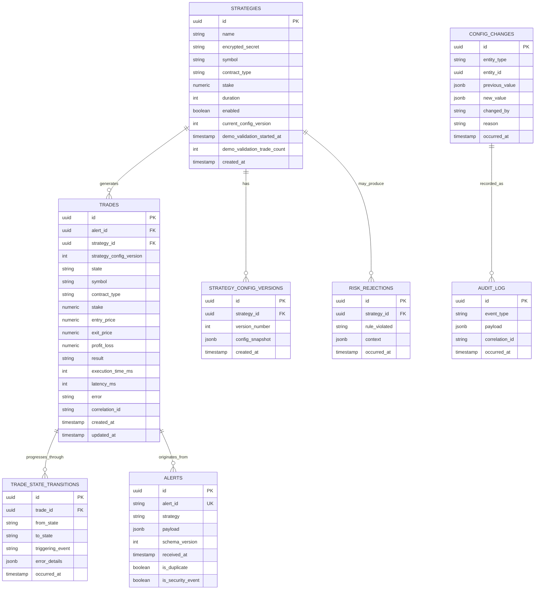
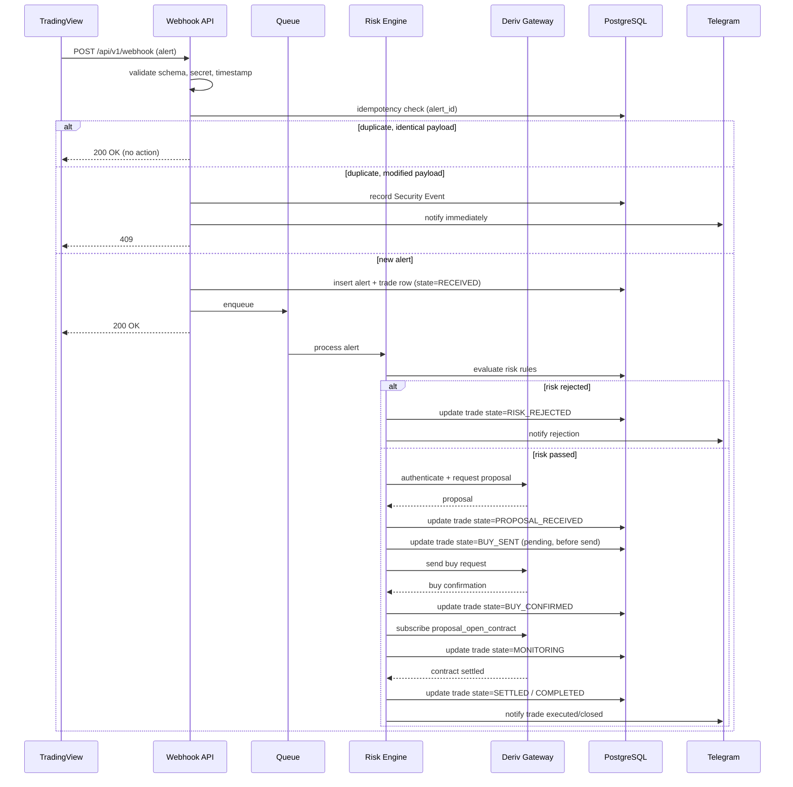
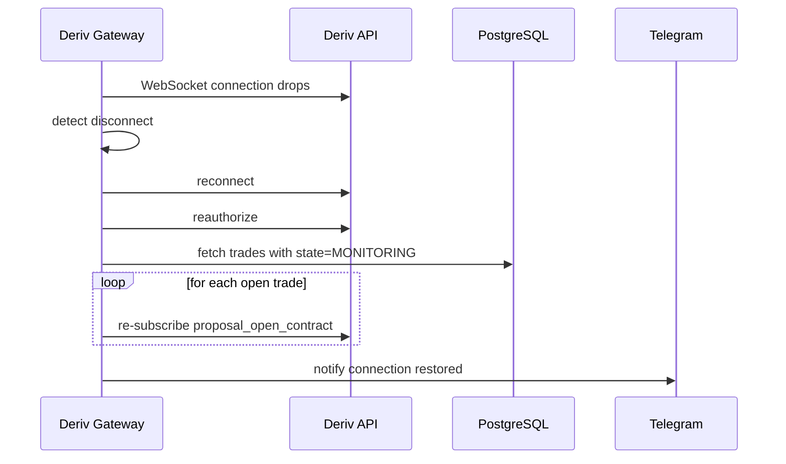
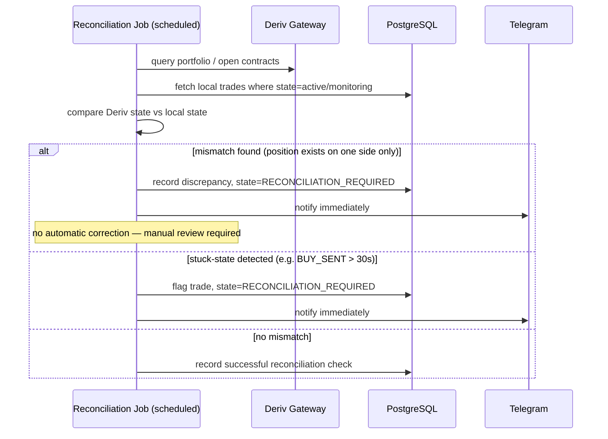
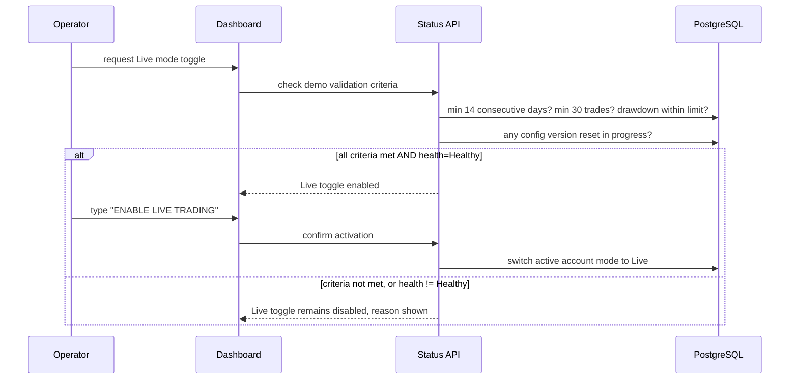

# Backend Documentation (merged)

> This file merges: API.md, ARCHITECTURE.md, DATABASE.md, INSTALLATION.md, RUNBOOK.md, SEQUENCE_DIAGRAMS.md, PRODUCTION_READINESS_CHECKLIST.md

---


<!-- ===================== docs/INSTALLATION.md ===================== -->

# Installation Guide

## Status

This project has not yet completed Phase 1 (Pre-Build Verification). Local
setup instructions below cover prerequisites only; application code will be
added as each phase is approved (see [`PHASES.md`](../PHASES.md)).

## Prerequisites

- Node.js (latest LTS)
- PostgreSQL (14+)
- Redis (with persistence enabled — AOF or RDB, see
  [Runbook](./RUNBOOK.md#redis-recovery))
- A Deriv account with a registered application (`app_id`) for both Demo
  and Live environments
- A Telegram bot token and target chat ID for notifications
- Railway CLI (for deployment, once reached)

## Setup (once Phase 2 is approved)

1. Clone the repository
2. Copy `.env.example` to `.env` and fill in values
3. Install dependencies: `npm install`
4. Run database migrations: `npm run migrate`
5. Start the development server: `npm run dev`

## Required Environment Variables

See [`.env.example`](../.env.example) for the full list. Do not commit a
populated `.env` file — it is excluded via `.gitignore`.

## Verifying Your Setup

Before any trading logic runs, the application performs Startup Validation
(database, queue, Deriv connectivity, authentication, clock sync, pending
migrations, required env vars). If any mandatory check fails, the app will
still start and serve `/api/v1/health`, but will report a `Critical` status
and keep automated trading disabled. See
[`docs/RUNBOOK.md`](./RUNBOOK.md#incident-response) for how to interpret
health check failures.

---

<!-- ===================== docs/ARCHITECTURE.md ===================== -->

# Architecture Overview

## Principles

- **Clean Architecture**: Presentation → Application → Domain →
  Infrastructure. Dependencies point inward; Domain has no knowledge of
  Express, React, BullMQ, PostgreSQL, Redis, or the Deriv SDK.
- **Ports & Adapters**: every external system (Deriv, Postgres, Redis,
  Telegram) is accessed through an interface defined in Application/Domain,
  with a concrete adapter in Infrastructure implementing it.
- **Event-driven internals**: major components communicate via domain
  events (see [Sequence Diagrams](./SEQUENCE_DIAGRAMS.md)) rather than
  direct calls, wherever practical.
- **Single Deriv access point**: `DerivGateway` is the only component
  permitted to call the Deriv API directly.

## Component Diagram



## Layers

| Layer | Contains |
|---|---|
| Presentation | Express routes, React dashboard, request/response DTOs |
| Application | Use cases / orchestration (e.g. `ExecuteTradeUseCase`), `QueuePort`, `DerivGatewayPort` interfaces |
| Domain | Trade entity & state machine, Strategy, Risk rules, domain events |
| Infrastructure | BullMQ adapter, PostgreSQL repositories, Deriv WebSocket client, Telegram client |

## Key Interfaces (Ports)

- `QueuePort` — enqueue, process, retry, dead-letter (implemented by
  BullMQ adapter)
- `DerivGatewayPort` — authenticate, proposal, buy, subscribe to contract,
  query portfolio (implemented by `DerivGateway`)
- `TradeRepositoryPort`, `StrategyRepositoryPort` — persistence
  (implemented by PostgreSQL adapters)
- `NotifierPort` — send notification (implemented by Telegram adapter)

## Trade Execution State Machine

See [`docs/adr/`](./adr/) for the ADR and the main specification for the
full state list, including `PROPOSAL_EXPIRED` and stuck-state detection.

## Related Documents

- [Database Design & ER Diagram](./DATABASE.md)
- [Sequence Diagrams](./SEQUENCE_DIAGRAMS.md)
- [Architecture Decision Records](./adr/)

---

<!-- ===================== docs/API.md ===================== -->

# API Documentation

All endpoints are versioned under `/api/v1`.

## `POST /api/v1/webhook`

Receives TradingView alerts.

**Request body**

```json
{
  "version": 1,
  "alert_id": "string (unique per alert)",
  "strategy": "string (strategy name)",
  "timestamp": "ISO 8601 string",
  "symbol": "string",
  "contract_type": "string",
  "stake": "number",
  "duration": "number"
}
```

**Supported schema versions:** `1` (initial). Unsupported or future versions
are rejected with `400` — see
[Webhook Schema Compatibility](../docs/adr/) and the addendum v7 rules.

**Validation performed, in order:**

1. Schema version check (reject unsupported versions)
2. Payload shape validation (Zod)
3. Secret validation (per-strategy webhook secret)
4. Timestamp / clock-skew validation (default tolerance: ±30s, configurable)
5. Idempotency check on `alert_id`:
   - New `alert_id` → accept, enqueue
   - Duplicate `alert_id`, identical payload → `200`, no re-trade, logged as
     duplicate
   - Duplicate `alert_id`, modified payload → `409` (or `400`), logged as a
     **Security Event**, Telegram notified immediately, never executed

**Responses**

| Status | Meaning |
|---|---|
| 200 | Alert accepted and queued, or recognized duplicate (no action taken) |
| 400 | Schema validation failed / unsupported schema version |
| 401 | Secret validation failed |
| 409 | `alert_id` reused with a modified payload (Security Event) |
| 422 | Timestamp outside allowed clock-skew window |
| 503 | System in Maintenance Mode or Critical health state (request is still
  logged; no trade executed) |

## `GET /api/v1/health`

Returns current health level (`Healthy` / `Degraded` / `Critical`) and the
status of each subsystem check (database, queue, Deriv connectivity,
Telegram, clock sync, pending migrations). Always available, even when the
system is in a Critical state — see Startup Validation in the main spec.

## `GET /api/v1/status`

Returns operational status: active account (Demo/Live), trading enabled/
disabled, Maintenance Mode state, circuit breaker state, per-strategy enabled
state.

## `GET /api/v1/trades`

Returns trade history with filtering/search support (by strategy, date
range, result). Backed by the Trade Journal.

---

*Full request/response schemas, pagination parameters, and error payload
shapes will be finalized during Phase 4 (Queue & Webhook) and documented here
alongside the implementation.*

---

<!-- ===================== docs/DATABASE.md ===================== -->

# Database Design

PostgreSQL. Schema managed via migrations. All trade lifecycle writes use
transactions. Audit logs are append-only (no `UPDATE`/`DELETE` grants at the
DB role level).

## ER Diagram



## Indexes

- `alerts(alert_id)` — unique, for idempotency lookups
- `trades(id)` (trade_id equivalent), `trades(strategy_id)`,
  `trades(created_at)`
- `trades(correlation_id)` — for tracing across the event-driven flow
- `strategies(name)` — unique

## Notes

- **Pending-before-buy write ordering**: a `trades` row is inserted with
  state `RECEIVED`/`QUEUED`/... and updated through the state machine —
  critically, a row exists with state `BUY_SENT` *before* the Buy request is
  sent to Deriv, not only after a response is received. See
  [Architecture](./ARCHITECTURE.md) and the state machine ADR.
- **Secrets at rest**: `strategies.encrypted_secret` is encrypted at the
  column level (e.g. `pgcrypto` or application-level encryption keyed from
  `DB_SECRET_ENCRYPTION_KEY`). Plaintext secrets must never be stored.
- **Config version reset**: any write to `strategy_config_versions` that
  changes trade-relevant parameters resets
  `demo_validation_started_at`/`demo_validation_trade_count` on the parent
  strategy.

---

<!-- ===================== docs/SEQUENCE_DIAGRAMS.md ===================== -->

# Sequence Diagrams

## 1. TradingView Alert → Trade Execution



## 2. Reconnection & State Recovery



## 3. Reconciliation Workflow



## 4. Circuit Breaker Activation

```mermaid
sequenceDiagram
    participant DG as Deriv Gateway
    participant CB as Circuit Breaker
    participant TE as Trading Engine
    participant TG as Telegram

    loop consecutive API calls
        DG->>DG: Deriv API call fails
        DG->>CB: report failure
    end
    CB->>CB: failure count reaches threshold (default 5)
    CB->>TE: disable automated trading
    CB->>TG: notify Circuit Breaker Activated
    Note over TE: monitoring continues; new trades blocked
    Note over CB: requires manual reset to resume
```

## 5. Demo → Live Validation



---

<!-- ===================== docs/RUNBOOK.md ===================== -->

# Operations Runbook

## Railway Deployment

1. Confirm `railway.json` and environment variables are set in the Railway
   project dashboard (never commit populated `.env`).
2. Deploy via `railway up` or the connected GitHub integration.
3. Verify `/api/v1/health` reports `Healthy` post-deploy before considering
   the deploy successful.
4. Confirm Redis and PostgreSQL add-ons are attached and persistence is
   configured (see [Redis Recovery](#redis-recovery)).

## Environment Configuration

- All secrets live in Railway's environment variable store, never in the
  repository.
- Reference [.env.example](../.env.example) for the required variable list.
- Any change to a live environment variable that affects trading behavior
  (stake, risk limits, thresholds) must be recorded in the audit log per the
  Config Change requirements in the main spec.

## Secret Rotation

1. Generate the new secret/token (Deriv API token, webhook secret, Telegram
   bot token) out of band.
2. Update the Railway environment variable.
3. Redeploy or trigger a config reload (mechanism to be finalized in
   Phase 2).
4. Confirm `/api/v1/health` still reports `Healthy` (Deriv connectivity,
   Telegram connectivity) after rotation.
5. Revoke the old secret/token at the source (Deriv dashboard, Telegram
   BotFather) only after confirming the new one is live.
6. Record the rotation in the audit log (who, when, why).

## Backup and Restoration

- PostgreSQL: automated daily backups via Railway's backup feature (or
  `pg_dump` on a schedule) with a tested restore procedure.
- Restoration must be rehearsed, not just documented — a restore that has
  never been tested is not a real recovery plan.

## Redis Recovery

- Redis must run with **AOF (appendonly) enabled**, or RDB snapshots at an
  interval short enough that the worst-case data loss window is acceptable
  and explicitly documented (default target: ≤60 seconds of queued alert
  data).
- On Redis restart: verify BullMQ jobs that were in-flight are either
  recovered from persistence or are caught by the Reconciliation Job as
  stuck/missing trades.
- After any Redis recovery event, run an out-of-cycle reconciliation check
  before re-enabling automated trading.

## PostgreSQL Recovery

- Verify latest backup integrity on a recurring schedule (not just on
  restore day).
- After recovery, run pending migrations, then Startup Validation, before
  allowing trading to resume.

## Monitoring

- Dashboard Status Bar and `/api/v1/health` are the primary at-a-glance
  views: TradingView, Queue, Deriv, Database, Railway, Last Signal, Last
  Trade, Current Latency.
- Track continuously: queue depth, p50/p95 execution time, WebSocket
  uptime, memory/CPU, restart count, webhook success rate.

## Incident Response

1. Check `/api/v1/health` for the specific failing subsystem(s) — the
   process stays up and reports `Critical` rather than crash-looping (see
   Startup Validation in the main spec).
2. Check Telegram for the most recent automated notification — Circuit
   Breaker, Reconciliation Mismatch, or Critical Errors will usually have
   already fired.
3. If automated trading is disabled, do not manually re-enable it until the
   root cause is identified and, if it involves open positions, a manual
   reconciliation against Deriv's actual portfolio has been performed.
4. Record the incident: what failed, when, how it was detected, how it was
   resolved, and whether a new safeguard is needed.

## Emergency Shutdown

- A single operator action (dashboard button or CLI command, finalized in
  a later phase) must be able to immediately disable all automated trading
  across all strategies without requiring a full redeploy.
- Emergency shutdown does not close open positions automatically — it only
  stops new trade execution. Closing existing positions, if needed, is a
  manual operator decision.

## Maintenance Mode

- Enabling Maintenance Mode: webhooks are still accepted, validated, and
  logged; no trades execute; dashboard clearly shows Maintenance Mode is
  active (distinct from a Critical health state — see main spec).
- Disabling Maintenance Mode: confirm health is not Critical before
  resuming automated trading.

## Production Rollback

1. Identify the last known-good deployment in Railway's deployment history.
2. Roll back via Railway's rollback feature.
3. Check for any database migrations introduced by the rolled-back version;
   if migrations are not backward compatible, a migration rollback may also
   be required — confirm before assuming the DB state matches the rolled
   back code.
4. Run Startup Validation and confirm `Healthy` before resuming trading.

---

<!-- ===================== docs/PRODUCTION_READINESS_CHECKLIST.md ===================== -->

# Production Readiness Checklist

Before Live trading can be enabled, **all** of the following must pass.
This checklist is enforced programmatically at runtime (see
`docs/adr/` for the relevant design), not just followed manually.

- [ ] Demo validation requirements met (≥14 consecutive days, ≥30 completed
      trades, drawdown within configured limit, all under the *current*
      strategy configuration version — no reset pending)
- [ ] All runtime health checks pass (health level = Healthy, not Degraded
      or Critical)
- [ ] Database healthy and reachable
- [ ] Queue healthy and reachable
- [ ] Deriv connectivity healthy, authentication valid
- [ ] No pending database migrations
- [ ] No unresolved reconciliation mismatches (including stuck-state
      detections)
- [ ] Circuit breaker inactive
- [ ] System clock synchronized within threshold
- [ ] Required environment variables present
- [ ] All enabled strategies pass validation (schema, encrypted secret
      present, risk limits configured)
- [ ] Operator has explicitly typed `ENABLE LIVE TRADING` to confirm

If any item fails, Live trading remains disabled and the specific failing
item is surfaced via `/api/v1/health` and the dashboard — never a silent or
generic failure.

---
