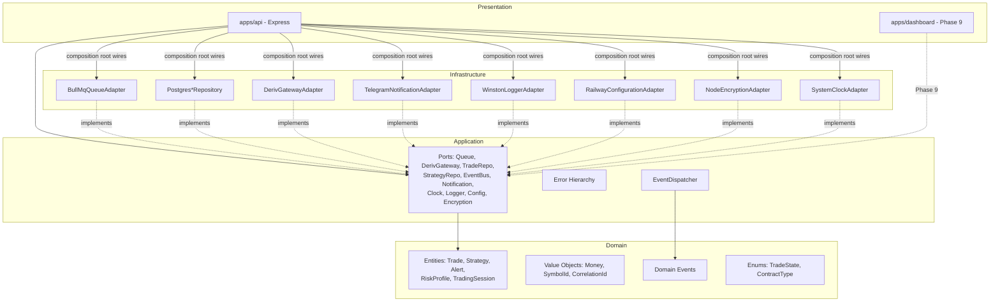

# Architecture Overview

## Layers (Clean Architecture)

**Dependency direction is one-way, inward:** Presentation and
Infrastructure both depend on Application/Domain; Domain depends on
nothing. This is what makes Infrastructure swappable (Postgres could
become another DB, BullMQ another queue) without touching business
rules, and what makes Domain/Application unit-testable without a real
database, queue, or Deriv connection — as proven by
`tests/unit/composition-root.test.ts`.

## Where wiring happens

`apps/api/src/composition-root.ts` is the **only** file in the entire
codebase that imports concrete Infrastructure classes and Application
port types together. Every other file imports either:
- Domain/Application types only (ports, entities, events), or
- Its own single Infrastructure technology (e.g. only
  `PostgresTradeRepository` imports `pg`-adjacent concerns)

This satisfies the Phase 2 requirement: "No layer may violate these
dependency rules" — see `docs/DEPENDENCY_RULES.md` for the enforced
rule set and how to check it.

## What's real vs. stubbed in Phase 2

| Component | Status |
|---|---|
| Domain entities, value objects, events, enums | ✅ Real, complete for this phase's scope |
| All 10 Application ports | ✅ Real, complete interfaces |
| Error hierarchy | ✅ Real, complete |
| EventDispatcher (in-process event bus) | ✅ Real, functional |
| WinstonLoggerAdapter | ✅ Real, functional |
| RailwayConfigurationAdapter | ✅ Real, functional |
| NodeEncryptionAdapter (AES-256-GCM) | ✅ Real, functional |
| SystemClockAdapter | ✅ Real, functional |
| TelegramNotificationAdapter | ✅ Real, functional (untested against live Telegram in this offline environment) |
| BullMqQueueAdapter | ⏳ Interface satisfied; body is Phase 4 |
| PostgresTradeRepository / PostgresStrategyRepository | ⏳ Interface satisfied; body is Phase 3 |
| DerivGatewayAdapter | ⏳ Interface satisfied; body is Phase 5 — endpoint/auth/rate-limit facts already encoded as constants per PHASE1_FINDINGS.md |
| Express server | ⏳ Only `/api/v1/health` exists, and it's a static stub — real Startup Validation is Phase 4+ |
| Dashboard | ⏳ Not started — Phase 9 |
